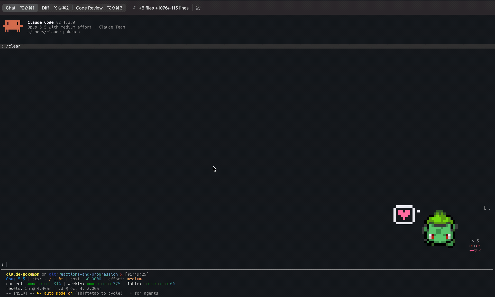
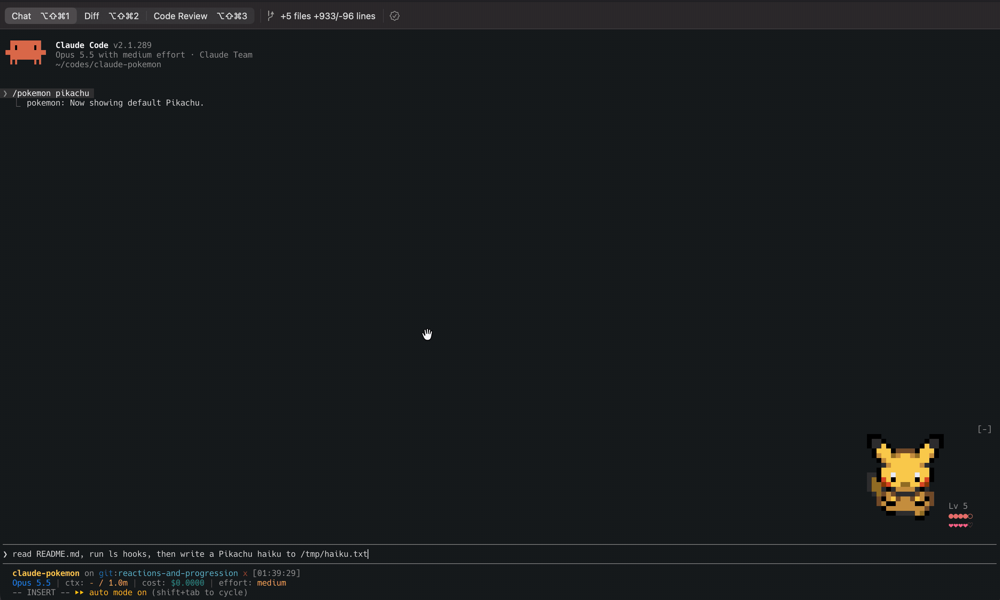
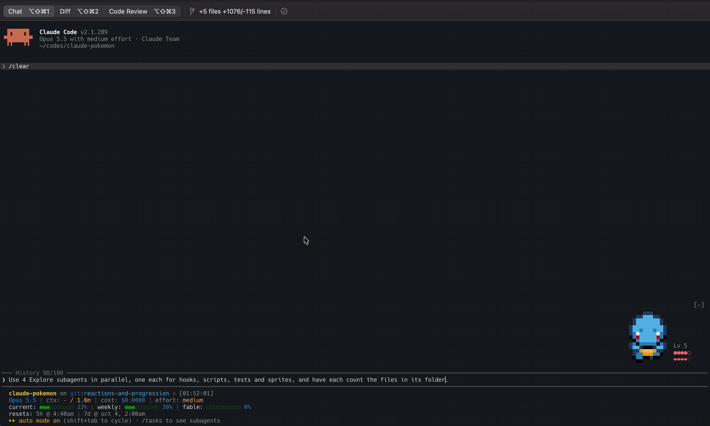
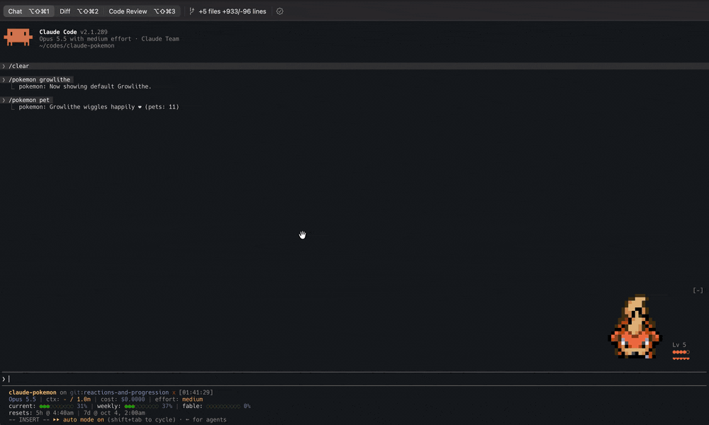
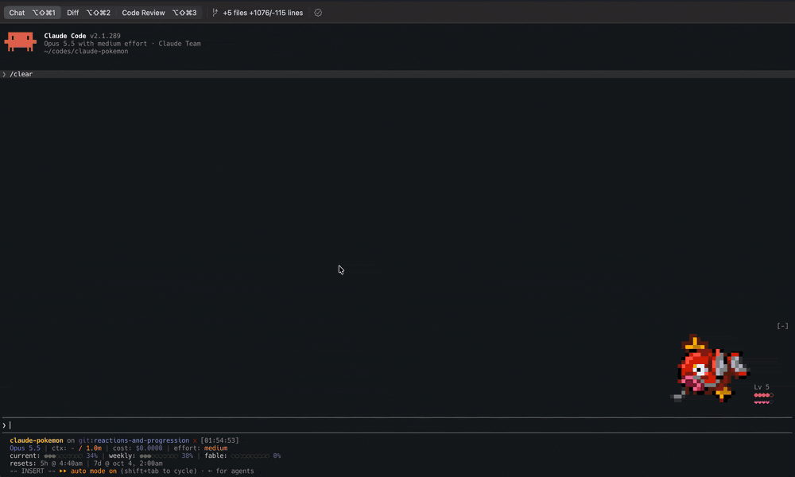

# pokemon

A Claude Code mod that draws one pixel Pokémon at the right edge of the band
above the prompt, reacting to what Claude is doing. It shows which tool Claude is
using, drops a Poké Ball for each subagent, and levels up and evolves as you work.
The mon, hearts, berries, bubbles, balls, and Zs are pixel art in one `Raster`. The
meters are one-cell characters.



The sprites come from [vscode-pokemon](https://github.com/jakobhoeg/vscode-pokemon)
by Jakob Hoeg Mørk. This is an unofficial fan project, not affiliated with Nintendo
or The Pokémon Company. See [Credits](#credits) and [Disclaimer](#disclaimer).

## Behavior

| When | The mon | Driven by |
| --- | --- | --- |
| Claude works | Paces back and forth across the strip | band `isWorking` |
| Claude thinks | Shows a pixel thought bubble with animated dots | spinner `mode === 'thinking'` |
| Claude runs a tool | The bubble shows the tool: a pencil for edits, a magnifier for reads and searches, `>_` for shell commands, a Poké Ball for subagents, and a wrench for anything else | `tool.call` (main agent only) |
| Claude needs you | Stops, faces you, and shows a red "!" until you answer. A minute after a turn with no word from you, it shows the "!" for 2 minutes | The AskUserQuestion and ExitPlanMode tools, `turn.complete`, and `classic.PermissionRequest` and `classic.Notification` for permission dialogs |
| A subagent runs | A Poké Ball drops into the strip, wobbles while the subagent works, and pops open when its turn ends. Past six, the last slot counts the rest as `+n` | `agent.spawn`, `turn.complete` |
| A turn ends | Hops twice, unless you interrupted it | `turn.complete` (main agent only) |
| A turn ends with an answer | Earns XP. A level-up shows a toast, and an evolution level makes it evolve. See [Levels and evolution](#levels-and-evolution) | `turn.complete` (main agent only) |
| You're idle | Strolls to random spots in the strip, resting 3 to 8 s between walks | |
| You're idle, wandering off | Walks home to the right edge and bobs there | |
| 5 minutes with no turns or typing | Falls asleep, with a small and a big pixel Z beside its head | `prompt.edit`, `prompt.submit`, turns |
| `/pokemon pet` | Stops, hops, and sends up a stream of big and small pixel hearts | |
| `/pokemon feed` | A random pixel berry drops nearby, the mon walks over, eats it a column at a time, and shows a bubble with a star | |
| `/pokemon attack` | Turns toward the side with more room, backs up to the edge behind it, and plays one of its moves for 1.5 to 4 s, so the whole animation stays in view. Moves on itself play in place, facing you | |
| Food or happiness under 30% | While idle and awake, shows a pixel thought bubble with a red berry (hungry) or a pink heart (lonely), taking turns when both are low | |
| Food under 30% | Walks slower, except on its way to a berry | |
| Happiness at 80% or more | Hops for joy every 20 to 40 s while idle and awake | |

Pikachu's bubble shows each tool while Claude reads `README.md`, lists `hooks`, and
writes a haiku. The answered turn takes Pikachu to Lv 6.



Four Explore subagents drop four Poké Balls beside Squirtle, and each ball pops open
when its subagent reports back.



Some organizations run a policy plugin that keeps the settings hooks' events
(`classic.*`) from reaching plugins you install yourself. Under one, the "!" still shows
for questions, plan approval, and the idle minute, but not for permission dialogs.

## Needs

Each mon has two meters at the bottom right of the band:

| Meter | Icons | Drains from full in | Filled by |
| --- | --- | --- | --- |
| Food | `●●●○○` in salmon pink | 8 hours | `/pokemon feed`: +35 |
| Happiness | `❤❤❤♡♡` in pink | 12 hours | `/pokemon pet`: +25, `/pokemon feed`: +5 |

Each icon is 20%. The meters are stored with a timestamp, so they keep draining while
Claude Code is closed. A new mon starts at 80%. The meters hide when the band is too
narrow for them.

The meters also scale the XP a turn earns, from half when both are empty to one and a
half when both are full. `/pokemon needs` turns needs off. The meters, the need bubbles,
and the hungry and happy behavior then go away, and XP ignores the meters. Petting and
feeding still play and still fill them.

## Levels and evolution

Each turn of the main agent that ends with an answer earns `10 + 2 × level` XP. A turn
of two minutes or more earns double, and the meters scale it as above. Levels follow
the medium fast curve from the games, where level L takes L³ XP. A new mon starts at
the lowest level the games allow it, which is 5 or the level it evolves at, so
Charmeleon starts at 16. With 30 s turns and well kept meters, a mon goes from 5 to 16
in about 75 turns and from 16 to 36 in about 400.

When a level-up reaches the mon's evolution level from Red and Blue, the evolution
starts once the mon is idle. It glows, flickers between its two shapes faster and
faster, and flashes into its new form. `/pokemon stop` cancels it, and the next level-up
tries again. The level, XP, and meters carry over to the evolved mon.

The 19 mons that evolve with a stone or a trade, like Pikachu, Eevee, and Kadabra,
evolve with `/pokemon evolve`. Eevee needs a pick, like `/pokemon evolve jolteon`.
Here Growlithe evolves into Arcanine with a Fire Stone.



The level shows above the meters as `Lv 12`, and in `/pokemon`.

## Requirements

- Claude Code v2.1.287 or later
- The terminal app. The Desktop app has no `Raster`, so the mod draws nothing there.
- A truecolor terminal (iTerm2, Ghostty, kitty, WezTerm). The band follows Claude
  Code's theme, so the bubble, the Zs, and the icons stay visible on light themes too.

## Install

```bash
claude plugin marketplace add dgokcin/claude-pokemon-mod
claude plugin install pokemon@claude-pokemon
```

To hack on it, clone the repo and add the clone instead
(`claude plugin marketplace add ./claude-pokemon-mod`). A local marketplace loads the
mod in place, so edits apply on `/reload-plugins`.

## Usage

| Command | Effect |
| --- | --- |
| `/pokemon` | Show the active mon, its variant, its level, its food and happiness, and the options |
| `/pokemon <mon>` | Pick a mon, like `/pokemon pikachu`, saved across sessions |
| `/pokemon list` | List every mon name |
| `/pokemon shiny`, `/pokemon default` | Pick a variant, saved across sessions |
| `/pokemon wander` | Toggle idle wandering (on by default), saved across sessions |
| `/pokemon pet` | Pet the mon. Wakes it up, and counts pets across sessions |
| `/pokemon feed` | Toss it a random oran 🫐, pecha 🍑, razz 🍓, or sitrus 🍋 berry. Counts feeds across sessions |
| `/pokemon attack` | Use a random move from the mon's moveset |
| `/pokemon attack <move>` | Use a specific move, like `/pokemon attack thunderbolt` |
| `/pokemon moves`, `/pokemon attack list` | List the active mon's moves |
| `/pokemon moves <mon>` | List another mon's moves, like `/pokemon moves charizard` |
| `/pokemon evolve` | Evolve with a stone or a trade, or now when a cancelled evolution's level is reached |
| `/pokemon evolve <mon>` | Pick what Eevee becomes, like `/pokemon evolve jolteon` |
| `/pokemon stop` | Cancel an evolution |
| `/pokemon needs` | Toggle food and happiness (on by default), saved across sessions |
| `/pokemon stats` | Show the level, the XP to the next one, how it evolves, the meters, and your pets and feeds |
| Ctrl+X Ctrl+A | Collapse or expand the band (Claude Code's own binding) |

## Attacks

Magikarp uses Splash, and nothing happens. Then Gengar uses Night Shade.



`/pokemon attack` picks a random move from the mon's moveset in `hooks/moves.js` and
replies `Pikachu used Thunderbolt!`. `/pokemon attack <move>` picks one by name,
ignoring case, spaces, and dashes. An unknown move lists the mon's moves, and so do
`/pokemon moves` and `/pokemon attack list`. While a move plays, the mon stops walking
and wakes up, and a second attack waits for it to end.

A move takes over the mon's body. A move aimed ahead turns the mon side on toward the
roomier side of the strip and backs it up to the edge behind it, a column a tick, so
the move plays across the whole strip, the framing every effect was tuned in. Then the
mon winds up, lunges, recoils, or leaps as it hits. A move on itself, like Harden or
Recover, plays where the mon stands and faces you, and the mon braces, shrinks, melts,
glows, or falls asleep instead.

`hooks/moves.js` has two tables. `MOVE_FX` gives each move its effect, plus an optional
`color`, a `power` of 1 or 2 for moves that share an effect at two sizes, and a `text`
line printed after the announcement. `MOVES` lists each mon's moves by name. An entry can
be `{ name, from: 'top' }` to send a move out of the top of the sprite, as Vine Whip and
the powders leave the Bulbasaur line's bulb, or `{ name, from: 'body' }` to pour it from
the whole body, as Koffing and Weezing do with Smog. An unknown effect plays `impact`.

The effects live in `hooks/effects/`, one file per family:

| File | Effects |
| --- | --- |
| `beams.js` | `hyperbeam`, `solarbeam`, `psybeam`, `aurorabeam`, `icebeam`, `bubblebeam` |
| `electric.js` | `thundershock`, `thunderbolt`, `thunder`, `thunderwave` |
| `fire.js` | `ember`, `flamethrower`, `firespin`, `dragonrage` |
| `water.js` | `watergun`, `hydropump`, `surf`, `waterfall`, `bubble`, `clamp` |
| `nature.js` | `vinewhip`, `razorleaf`, `petaldance`, `leechseed`, `drain`, `leechlife`, `powder`, `stringshot` |
| `poison.js` | `poisonsting`, `twineedle`, `acid`, `sludge`, `gas`, `pinmissile`, `spikecannon` |
| `mind.js` | `confusion`, `psychic`, `kinesis`, `hypnosis`, `nightshade`, `lick`, `confuseray`, `dreameater` |
| `sound.js` | `screech`, `supersonic`, `growl`, `roar`, `sing`, `lovelykiss` |
| `charge.js` | `tackle`, `quickattack`, `bodyslam`, `headbutt`, `skullbash`, `takedown`, `rage`, `thrash`, `outrage`, `hornattack`, `horndrill`, `stomp`, `slam` |
| `strikes.js` | `pound`, `doubleslap`, `megapunch`, `cometpunch`, `firepunch`, `icepunch`, `thunderpunch`, `megakick`, `lowkick`, `doublekick`, `hijumpkick`, `seismictoss`, `submission`, `karatechop` |
| `weapons.js` | `scratch`, `slash`, `furyswipes`, `cut`, `bite`, `hyperfang`, `crabhammer`, `vicegrip`, `guillotine`, `peck`, `drillpeck`, `furyattack`, `boneclub`, `bonemerang`, `wrap` |
| `sky.js` | `gust`, `wingattack`, `fly`, `skyattack`, `agility`, `doubleteam` |
| `earth.js` | `earthquake`, `dig`, `rockthrow`, `rockslide`, `sandattack`, `blizzard`, `mist` |
| `guard.js` | `harden`, `withdraw`, `defensecurl`, `minimize`, `focusenergy`, `meditate`, `amnesia`, `barrier`, `reflect`, `lightscreen`, `acidarmor` |
| `self.js` | `recover`, `softboiled`, `rest`, `splash`, `teleport`, `transform`, `explosion` |
| `special.js` | `swift`, `payday`, `triattack`, `eggbomb` |
| `evolve.js` | `evolve`, the evolution sequence, played by evolving rather than as a move |
| `basic.js` | `impact`, the fallback |

`hooks/effects/draw.js` holds the shared drawing helpers and lists what an effect can do
to a frame. Teleport leaves the mon at a random spot, Dig tunnels it forward, Transform
borrows another mon's sprite for a few seconds, and Splash does nothing at all.

To watch a move frame by frame without a terminal, render it to a PNG contact sheet:

```bash
node scripts/preview-attack.mjs pikachu thunderbolt          # from home, aiming left
node scripts/preview-attack.mjs pikachu thunderbolt --at 2   # from the left edge, aiming right
```

## Mons

All 151 gen 1 Pokémon are included, plus the `pikachu_female` and `venusaur_female`
variants. Names match the source folders, so use `mrmime`, `farfetchd`,
`nidoran_female`, and `nidoran_male`. Each mon has a default and a shiny variant.

The source GIFs are 32x32. The build crops each mon to the smallest box that fits
all its frames, so the band height depends on the cropped height. The band uses
one row per two pixels, plus one row of headroom for the hop. Diglett is the
smallest at 12 px (7 rows). Fearow, Gyarados, and Pidgeot are the tallest at
31 px (17 rows).

In fullscreen, Claude Code gives the band at most half the pane, minus the prompt and
the status line, so a split pane can leave it only a few rows. When the mon doesn't
fit, the band draws the scene at full size and then shrinks the whole strip to fit.
Each shrunk pixel takes the most common color of the block it covers, and ties go to
the darker color so outlines and eyes survive. Below 4 rows the band shows a line of
text instead, like `Pikachu Lv 12 ●●●●○ ❤❤❤❤♡`. A pane that only changes height gets
its new fit on the next redraw, within a minute.

## Add a mon

1. Copy the four GIFs from `media/gen<N>/<mon>/` in [jakobhoeg/vscode-pokemon](https://github.com/jakobhoeg/vscode-pokemon/tree/main/media) into `sprites/<mon>/`.
   The files are `default_idle_8fps.gif`, `default_walk_8fps.gif`, `shiny_idle_8fps.gif`, and `shiny_walk_8fps.gif`.
2. Run `node scripts/build-frames.mjs`.
3. Run `/reload-plugins`. The mod loads in place from the repo, so no version bump or reinstall is needed.

## Layout

| Path | Contents |
| --- | --- |
| `hooks/register.js` | Band renderer, animation timer, `/pokemon` command |
| `hooks/attacks.js` | Attack registry: each move's pose, aim, and frame |
| `hooks/effects/*.js` | Attack animations, one file per family, on the helpers in `draw.js` |
| `hooks/moves.js` | Each move's effect, and each mon's moveset |
| `hooks/names.js` | Display names, like `Nidoran♀` and `Mr. Mime` |
| `hooks/levels.js` | The XP curve, and the XP a turn earns |
| `hooks/evolutions.js` | Gen 1 evolutions, and each mon's start level |
| `hooks/party.js` | The Poké Balls of running subagents |
| `hooks/zoom.js` | Shrinks the band's frame to fit a short pane |
| `hooks/frames.js` | Generated pixel frames. Don't edit by hand. |
| `sprites/<mon>/*.gif` | Source GIFs, 32x32 |
| `scripts/build-frames.mjs` | Regenerates `frames.js` from the GIFs with ffmpeg |
| `scripts/preview-attack.mjs` | Renders a move to a PNG contact sheet, one frame per tick |
| `scripts/check-data.mjs` | Checks that the moves, evolutions, and sprite frames agree |
| `tests/pokemon.test.ts` | `claude plugin test` suite |
| `biome.json` | Lint rules |
| `cliff.toml` | How git-cliff writes `CHANGELOG.md` and release notes |
| `.github/workflows/ci.yml` | Lint, checks, tests, and releases |

## Development

```bash
node scripts/build-frames.mjs      # after changing sprites/
node scripts/preview-attack.mjs <mon> <move>   # writes /tmp/<mon>-<move>.png
node scripts/check-data.mjs        # moves, evolutions, and sprite frames agree
npx @biomejs/biome@2.5.15 ci .     # lint
claude plugin validate .
claude plugin test
claude --plugin-dir .              # live-reloading session
```

Each terminal cell holds two vertical pixels with `▀`/`▄` half blocks. The
sprite paces inside a 40 column strip.

CI runs the lint, the table check, and `claude plugin test` on every pull request and
push to `main`. Commits follow [Conventional Commits](https://www.conventionalcommits.org),
and a push to `main` that passes releases on its own when it brings a `feat`, `fix`, or
`perf` commit since the last release. git-cliff works out the version (a feature bumps
the minor version, a fix the patch), and the release job bumps `plugin.json`, updates
`CHANGELOG.md`, tags the commit, and publishes the GitHub release. Docs, tests, and
chores don't release on their own.

## Credits

The sprites come from [vscode-pokemon](https://github.com/jakobhoeg/vscode-pokemon)
by [Jakob Hoeg Mørk](https://github.com/jakobhoeg), the extension that puts Pokémon
in your VS Code window. Those GIFs took slow, manual work to extract and make, and
this mod would not exist without them. If you like the mod, give the original a star.

- `sprites/` holds unmodified copies of the gen 1 GIFs from vscode-pokemon's
  [`media/`](https://github.com/jakobhoeg/vscode-pokemon/tree/main/media) folder.
- `hooks/frames.js` holds the pixel frames that `scripts/build-frames.mjs` generates
  from those GIFs.
- vscode-pokemon builds on [vscode-pets](https://github.com/tonybaloney/vscode-pets)
  by [Anthony Shaw](https://github.com/tonybaloney).

## Disclaimer

This is an unofficial, non-commercial fan project. It is not affiliated with,
endorsed by, or sponsored by Nintendo, Creatures Inc., GAME FREAK inc., or The
Pokémon Company.

Pokémon and Pokémon character names are trademarks of Nintendo. The sprite artwork
is © Nintendo, Creatures Inc., GAME FREAK inc., and The Pokémon Company. Rights
holders who want anything removed can open an issue.
